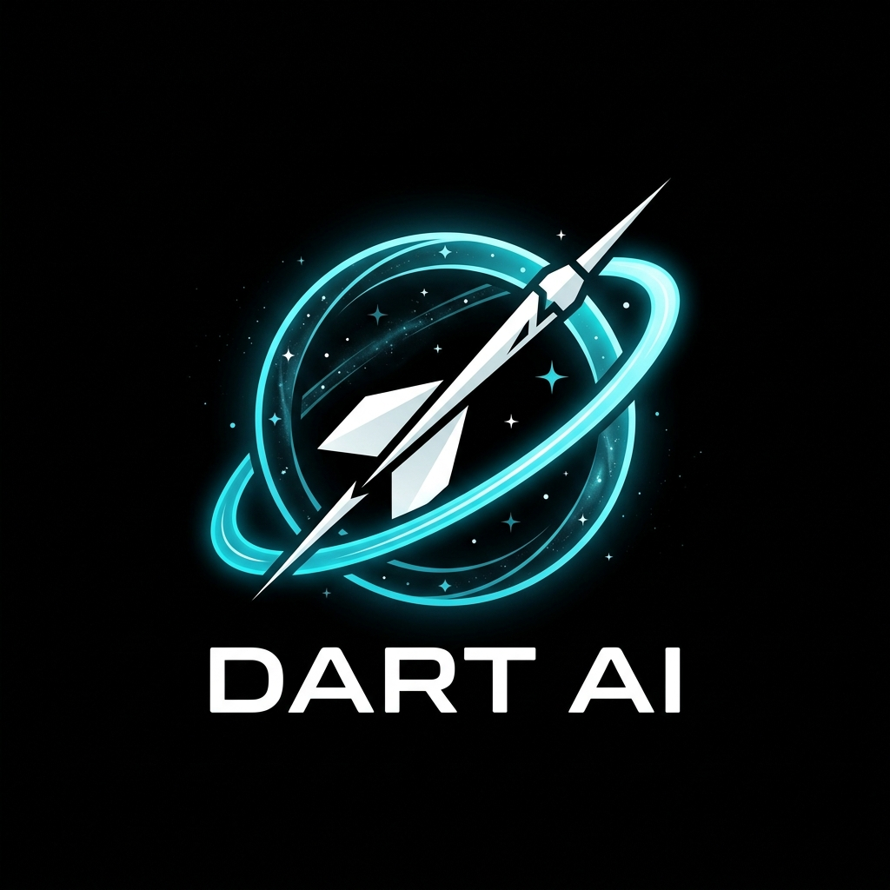

<div align="center">



# DART AI Studio

**The all-in-one AI platform** — Chat, Images, Music, Voice, Search, Code, Agent Swarm & more.

[](https://python.org)
[](https://fastapi.tiangolo.com)
[](LICENSE)
[](https://github.com/saiarjunkoyalkar756-sudo/DART-AI/pulls)

[Live Demo](#) · [Features](#features) · [Quick Start](#quick-start) · [API Docs](#api-reference) · [Deploy](#deployment)

</div>

---

## Features

| Category | Capabilities |
|---|---|
| 🤖 **Multi-Model AI Chat** | DeepSeek V3, GPT-4o, Gemini 2.0, Kimi, Grok, Qwen, Perplexity — switchable mid-conversation |
| 🖼️ **Image Generation** | FLUX.1, DALL-E 3, Stable Diffusion via router |
| 🎵 **Music Generation** | Suno AI integration with polling and audio player |
| 🔊 **Voice / TTS** | GPT-4o Realtime streaming TTS, Speech-to-Text, hands-free mode |
| 🔍 **Web Search** | Real-time web search with source citations |
| 🧠 **RAG & Document Search** | Upload PDFs, chunk + embed, semantic vector search |
| 🤝 **Agent Swarm** | Planner → Researcher → Coder → Critic multi-agent pipeline |
| 📁 **Projects Workspace** | Organize chats, files, images by workspace |
| 🔐 **Auth & Security** | Google OAuth, Email/Password, Magic Link, JWT, RBAC, Rate Limiting |
| 📧 **Temp Email** | Disposable inbox with live polling |
| 💻 **Code Editor** | Live HTML/CSS/JS preview editor |
| 📊 **Admin Dashboard** | System metrics, provider health, feature flags |
| 📱 **PWA** | Installable, offline-capable Progressive Web App |

---

## Quick Start

### Prerequisites
- Python 3.12+
- At least one AI provider API key

### 1. Clone & install

```bash
git clone https://github.com/saiarjunkoyalkar756-sudo/DART-AI.git
cd DART-AI
pip install -r requirements.txt
```

### 2. Configure environment

```bash
cp .env.example .env
# Edit .env and add your API keys
```

Minimum required in `.env`:

```env
OPENAI_API_KEY=sk-...          # For GPT-4o, TTS, image gen
DEEPSEEK_API_KEY=...           # For DeepSeek V3 (recommended default)
SECRET_KEY=your-random-secret  # Generate: python -c "import secrets; print(secrets.token_hex(32))"
```

### 3. Run

```bash
python -m uvicorn app.main:app --reload --port 8000
```

Open → **http://localhost:8000**

---

## Environment Variables

| Variable | Required | Description |
|---|---|---|
| `OPENAI_API_KEY` | ✅ | GPT-4o, TTS, DALL-E |
| `DEEPSEEK_API_KEY` | ✅ | DeepSeek V3 chat |
| `GEMINI_API_KEY` | Optional | Google Gemini 2.0 |
| `KIMI_API_KEY` | Optional | Moonshot Kimi |
| `GROK_API_KEY` | Optional | xAI Grok |
| `SUNO_API_KEY` | Optional | Music generation |
| `SECRET_KEY` | ✅ | JWT signing key |
| `ADMIN_SECRET_KEY` | Optional | Admin API key (default: `admin-secret-key`) |
| `GOOGLE_CLIENT_ID` | Optional | Google OAuth |
| `GOOGLE_CLIENT_SECRET` | Optional | Google OAuth |
| `DATABASE_URL` | Optional | Default: SQLite (`app/data/dart.db`) |
| `ALLOWED_ORIGINS` | Optional | CORS origins (default: `*` in dev) |

---

## Project Structure

```
DART-AI/
├── app/
│   ├── main.py              # FastAPI app entry point
│   ├── config.py            # Settings & env vars
│   ├── db.py                # SQLAlchemy database
│   ├── api/                 # API route modules
│   │   ├── chat.py          # Chat streaming endpoint
│   │   ├── image.py         # Image generation
│   │   ├── music.py         # Music generation
│   │   ├── search.py        # Web search
│   │   ├── tts.py           # Text-to-speech
│   │   ├── auth.py          # Auth endpoints
│   │   ├── admin.py         # Admin dashboard API
│   │   ├── swarm.py         # Agent swarm orchestration
│   │   ├── rag_engine.py    # RAG vector search engine
│   │   ├── memories.py      # User memory/preferences
│   │   └── v1.py            # Public developer API v1
│   ├── middleware/
│   │   ├── rate_limit.py    # Rate limiting (60 req/min)
│   │   ├── auth_rbac.py     # Role-based access control
│   │   ├── csrf.py          # CSRF protection
│   │   └── security_headers.py
│   ├── agents/
│   │   ├── orchestrator.py  # Swarm coordinator
│   │   ├── coder.py         # Coder agent
│   │   ├── researcher.py    # Researcher agent
│   │   └── critic.py        # Critic agent
│   ├── services/
│   │   ├── jwt.py           # JWT token service
│   │   ├── oauth.py         # Google OAuth
│   │   ├── email.py         # Magic link email
│   │   └── passwords.py     # Password hashing
│   └── static/
│       ├── index.html       # Single-page application
│       ├── app.js           # Frontend logic (~2600 lines)
│       ├── style.css        # Dark theme CSS
│       ├── sw.js            # Service Worker (PWA)
│       └── manifest.json    # PWA manifest
├── tests/
│   ├── test_api.py          # Integration test suite
│   └── test_v1_1_security.py
├── Dockerfile               # Production container
├── docker-compose.yml       # Full stack (FastAPI + PG + Redis)
├── nginx.conf               # Reverse proxy config
├── requirements.txt
└── .env.example
```

---

## API Reference

The full OpenAPI docs are available at `/docs` when the server is running.

### Key endpoints

| Method | Endpoint | Description |
|---|---|---|
| `POST` | `/api/chat` | Chat completion (streaming SSE) |
| `POST` | `/api/image/generate` | Image generation |
| `POST` | `/api/music/generate` | Music generation |
| `POST` | `/api/tts` | Text-to-speech |
| `POST` | `/api/search` | Web search |
| `POST` | `/api/upload` | File/PDF upload for RAG |
| `GET` | `/api/conversations` | List conversations |
| `GET` | `/api/models` | Available AI models |
| `GET` | `/health` | Health check |
| `GET` | `/api/admin/metrics` | System metrics (admin) |
| `GET` | `/v1/chat/completions` | OpenAI-compatible API |

### Developer API (v1 — OpenAI compatible)

```bash
curl -X POST http://localhost:8000/v1/chat/completions \
  -H "Content-Type: application/json" \
  -d '{"model": "deepseek-v3", "messages": [{"role": "user", "content": "Hello"}]}'
```

---

## Deployment

### Docker Compose (recommended)

```bash
cp .env.example .env   # Fill in API keys
docker compose up -d --build
```

Starts: FastAPI + PostgreSQL 16 + Redis 7 + Nginx

### Railway (1-click)

1. Push to GitHub
2. Go to [railway.app](https://railway.app) → **New Project → Deploy from GitHub**
3. Select this repo, set env vars from `.env.example`
4. Deploy ✅

### Render

1. New Web Service → connect repo
2. Start command: `uvicorn app.main:app --host 0.0.0.0 --port $PORT`
3. Add env vars → Deploy

---

## Security

- JWT-signed sessions with configurable expiry
- RBAC middleware (Owner / Admin / User roles)
- Rate limiting: 60 requests/minute per IP
- CSRF token protection
- Security headers (HSTS, X-Frame-Options, CSP)
- Non-root Docker user (`dartai`)
- `.env` excluded from git — never committed

Found a vulnerability? Open a [security advisory](https://github.com/saiarjunkoyalkar756-sudo/DART-AI/security/advisories/new).

---

## Running Tests

```bash
python -m unittest tests/test_api.py -v
```

7 integration tests covering: health, models, chat, RBAC, memories, analytics, and v1 API.

---

## Tech Stack

**Backend:** FastAPI · SQLAlchemy · Alembic · Uvicorn · Python 3.12  
**Frontend:** Vanilla JS · CSS3 · Web Components · PWA · Canvas API  
**AI Providers:** OpenAI · DeepSeek · Google Gemini · Moonshot · xAI · Suno  
**Infrastructure:** Docker · PostgreSQL · Redis · Nginx · GitHub Actions CI  

---

## Contributing

1. Fork the repo
2. Create a branch: `git checkout -b feature/your-feature`
3. Commit: `git commit -m 'feat: add your feature'`
4. Push: `git push origin feature/your-feature`
5. Open a Pull Request

---

## License

MIT © 2025 [saiarjunkoyalkar756-sudo](https://github.com/saiarjunkoyalkar756-sudo)

---

<div align="center">
Built with FastAPI · Powered by DeepSeek, GPT-4o & Gemini
</div>
